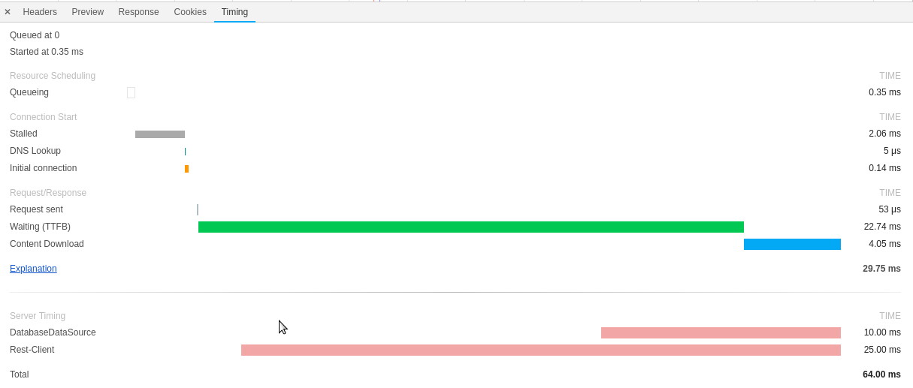

# Thalia Spring Boot Starter for Call Tracing and distributed Profiling

[](https://travis-ci.org/ThaliaBuecherGmbH/thalia-trace-starter) [](https://maven-badges.herokuapp.com/maven-central/de.thalia.boot.trace/thalia-trace-starter)

## Why

Our services live in an interconnected and distributed world. Services take requests, have to talk to other services
and compute results based on gathered data. This distributed nature makes it hard to track application performance and
find potential performance bottlenecks. 

There are some very famous tracing solutions (e.g. Zipkin/Opentracing) available. Most of them gather invocation traces in some way
and write them back to a central data store. Traces can then be analyzed. This concept introduces some drawbacks:

* The central data store tends to become *really huge* on high traffic sites
* Tracing is always enabled. We gather a lot of data, but most of it isn't touched again
* Infrastructure costs can and *will* explode
* We introduce a possible (security) singularity in form of the central data store

And here comes our starter into play!

Our starter provides tracing and monitoring on a per request basis. By default performance
metrics are gathered for any incoming request. The application only exposes those metrics as 
part of its response *if the caller demands it*. Metrics are therefore not written to a central data store, 
but provided to the caller, who can itself propagate the metrics to its caller and so on. As the final result, 
the initial entry point of the invocation chain receives performance metrics of the whole chain!
This simple mechanism allows us to

* Collect metrics transparently of complex invocation chains
* Keep infrastructure costs low. We do not need a big central data store
* Reduce or eliminate security concerns
* Support our development teams to keep an eye on application and system performance

## How

Internally metrics are gathered by instrumenting Spring managed `org.springframework.web.client.RestTemplate` 
and `java.sql.DataSource` beans. These instrumentation writes invocation statistics as spans into a HTTP request specific repository
This repository is managed by a `javax.servlet.Filter`, which is weaved around the whole application. This
filter toggles monitoring feature state and exposes the gathered spans to the caller if he demands it.

The whole instrumentation part is handled by a Spring Boot starter. We follow a zero
configuration approach.

## Minimum requirements

* Java 1.8
* Spring Boot 2

## Available instrumentations

* HTTP (Spring MVC, Spring Boot Actuator, Servlets)
* Spring managed `org.springframework.web.client.RestTemplate`
* Spring managed `org.springframework.boot.web.client.RestTemplateBuilder`
* Spring managed JDBC `java.sql.DataSource`
* Hystrix commands by custom `com.netflix.hystrix.strategy.executionhook.HystrixCommandExecutionHook`
* Resilience4J Circuit Breaker by intercepting `io.github.resilience4j.circuitbreaker.annotation.CircuitBreaker `

## Configuration

Add the following Maven dependency to your Spring Boot 2 project:

```
<dependency>
    <groupId>de.thalia.boot.trace</groupId>
    <artifactId>thalia-trace-starter</artifactId>
    <version>1.1.0</version>
</dependency>
```

This will automatically enable the feature. Please make sure the following Spring configuration
properties are set:

```
spring.application.name=<name of your application>
```

Invocation stats are automatically collected on
a per request basis, but not yet exposed to the outside world. This must be enabled by sending
the following HTTP header:

```
THALIATRACE: true
```

Please note that Datasource instrumentation is disabled by default. You have to enable it by 
setting the following configuration property:

```
tracing.database.enabled=true
```

How we are getting two new HTTP headers as part of the response:

```
THALIATRACE: <JSONDATA>
``` 

Here is an example of such a JSON structure:

```
{
  "applicationName": "Suchservice (Integ)",
  "hostName": "fullqualifiedhostname.domain",
  "startTime": 1533031487780,
  "duration": 1062,
  "spans": [
    {
      "name": "dataSourceSuchserviceDb",
      "startTime": 1533031487786,
      "duration": 1,
      "numberQueries": 1,
      "datasourceName": "dataSourceSuchserviceDb"
    },
    {
      "name": "Solr#SolrHystrixCommand",
      "startTime": 1533031487789,
      "duration": 592
    },
    {
      "name": "Artikelservice#OnlineArtikelserviceHystrixCommand",
      "startTime": 1533031488398,
      "duration": 114
    },
    {
      "name": "TouchpointTemplate#TouchpointTemplateHystrixCommand",
      "startTime": 1533031488531,
      "duration": 291
    }
  ]
}
```

As part of the response you also get a HTTP Server-Timing header as 
described [by the W3C Server Timing working draft](https://www.w3.org/TR/server-timing).
This header is automatically integrated into the Chrome Developer Tools Timing information. This is neat,
as now QA engineers get a quick overview of application performance metrics and possible
bottlenecks. 



## Extension points

Gathered invocation statistics are on a per request basis and not collected in a central data store by
design. But it is possible to write aggregated information into a time series database for operational
or KPI monitoring. This can be done by providing a custom implementation of the 
`de.thalia.boot.tracing.MetricExporter` interface. Our implementation at Thalia writes the aggregated
data into an Influx time series database, and we use Grafana to create nice dashboards like this one:


